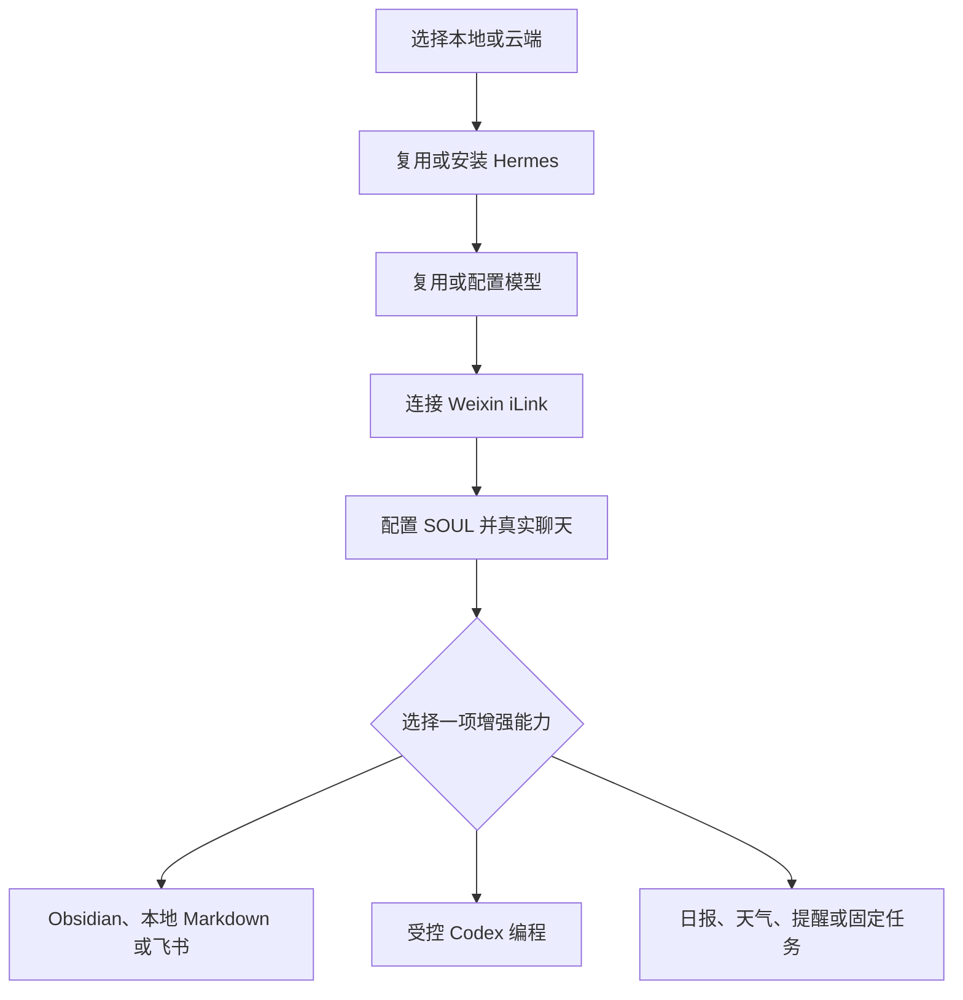

# build-wechat-assistant

用简体中文陪普通用户搭建自己的微信 AI 助手：先完成本地或云端、Hermes、模型、Weixin iLink 与人格五步基础闭环，再按需增加知识库、受控 Codex 编程和日常自动化。

> 当前版本：**V0.5**。许可证：[Apache-2.0](LICENSE)。仓库版本唯一来源为 [`VERSION`](VERSION)。

## 它解决什么

- 用户不需要懂终端：Agent 负责检查、安装、配置和验证。
- 第一步先决定本地或云端，避免在错误机器上重复安装 Hermes、模型或微信助手。
- 已有 Hermes 和模型优先复用；配置存在不等于可用，必须以真实回复为准。
- 基础聊天完成后才展示知识库、编程与日报，不提前索要文件或项目权限。
- 知识库默认只读；把本地或飞书内容交给模型，以及创建、更新和回滚，都逐次确认。
- Codex 先在一次性 Git worktree 生成补丁，第二次确认才应用；不默认提交、推送、发布或部署。
- 定时任务必须先手动运行并取得持久回执；只有微信真实收到才算投递通过。

## 流程



## 当前可交付范围

| 能力 | 包内实现 | 默认边界 |
|---|---|---|
| 基础微信助手 | Hermes Agent + 官方 Weixin iLink 适配器 | 单人私聊、许可名单、群聊关闭 |
| 本地知识库 | `scoped_knowledge_mcp.py` | 一个获准目录；先只读；写入可回滚 |
| 飞书知识库 | `scoped_feishu_mcp.py` | 固定文档读取；创建只能写入固定父目录 |
| 编程 | `scoped_coding_mcp.py` | 当前仅交付 Codex；固定 Git 仓库；两次确认 |
| 自动化 | Hermes cron | 固定 Profile、时区、脚本目录和投递目标 |

Claude Code 与 OpenCode 目前只提供比较和检测流程，没有等价受限执行器时不能宣传为已接入。云端助手也不能天然控制本机代码或 Obsidian；跨设备桥接不在本版本交付范围内。

## 目录结构

```
build-wechat-assistant/
├── SKILL.md              # Skill 主说明（元数据 + 完整流程）
├── agents/openai.yaml    # UI 展示元数据
├── assets/               # 人格模板、测试夹具
├── references/           # 按需加载的参考文档
├── scripts/              # 检查器、隔离器、交接器与测试
├── LICENSE               # Apache-2.0
├── README.md
├── VERSION
└── .github/              # CI、Issue/PR 模板
```

## 安装

本 Skill 是一份标准 Agent Skill（含 `SKILL.md` 的目录），可安装到任何支持本地 Skills 的 Agent。把仓库克隆到你的 Agent 的 skills 目录，目录名保持 `build-wechat-assistant`：

| Agent | skills 目录（用户级） | 安装命令 |
|---|---|---|
| Codex | `~/.codex/skills/` | `git clone https://github.com/luqi67677/build-wechat-assistant.git ~/.codex/skills/build-wechat-assistant` |
| Kimi Code | `~/.agents/skills/` | `git clone https://github.com/luqi67677/build-wechat-assistant.git ~/.agents/skills/build-wechat-assistant` |
| Claude Code | `~/.claude/skills/` | `git clone https://github.com/luqi67677/build-wechat-assistant.git ~/.claude/skills/build-wechat-assistant` |
| Hermes | `<HERMES_HOME>/skills/`（默认 `~/.hermes/skills/`，以 `hermes -p <Profile> config path` 实际解析为准） | `git clone https://github.com/luqi67677/build-wechat-assistant.git ~/.hermes/skills/build-wechat-assistant` |

- Kimi Code 也支持项目级安装：克隆到项目根目录的 `.agents/skills/build-wechat-assistant`，只在该项目内生效。
- 其他 Agent：先查其官方文档确认支持本地 Skills 目录，再按同样方式克隆；不支持本地 Skills 的宿主无法使用。
- 想验证安装包完整性或了解多宿主共享一份目录的维护方式，见 [`references/install-skill.md`](references/install-skill.md)。

安装后重新加载 Agent（Codex 重启或新建任务；Kimi Code / Claude Code 重开会话；Hermes 对目标 Profile 新开会话），确认 Agent 的 skills 列表里出现 `build-wechat-assistant` 即可使用。

## 使用

直接向你的 Agent 描述目标，例如：

- 「使用 $build-wechat-assistant 帮我搭一个微信 AI 助手」（`$` 前缀是 Codex 的写法；Kimi Code、Claude Code 用自然语言描述目标即可触发，例如「帮我搭一个微信 AI 助手」）
- 「把现有的微信助手迁移到云端」
- 「给已有助手加一个知识库」

Skill 会引导你完成五步闭环，并在真实私聊往返通过后才标记「聊天可用」。

## 安全

不要在 Issue、聊天、截图或日志中提交 API key、微信 token、二维码、Cookie、`.env`、真实用户 ID、私人文档或绝对个人路径。安全问题请按 [`SECURITY.md`](SECURITY.md) 私下报告。

## 参与贡献

修改前请阅读 [`CONTRIBUTING.md`](CONTRIBUTING.md)。保持 Skill 文件树最小化，不要把 README、变更日志或发布材料混入 Skill 文件树。

## 许可证

[Apache-2.0](LICENSE)，Copyright 2026 焱七。
