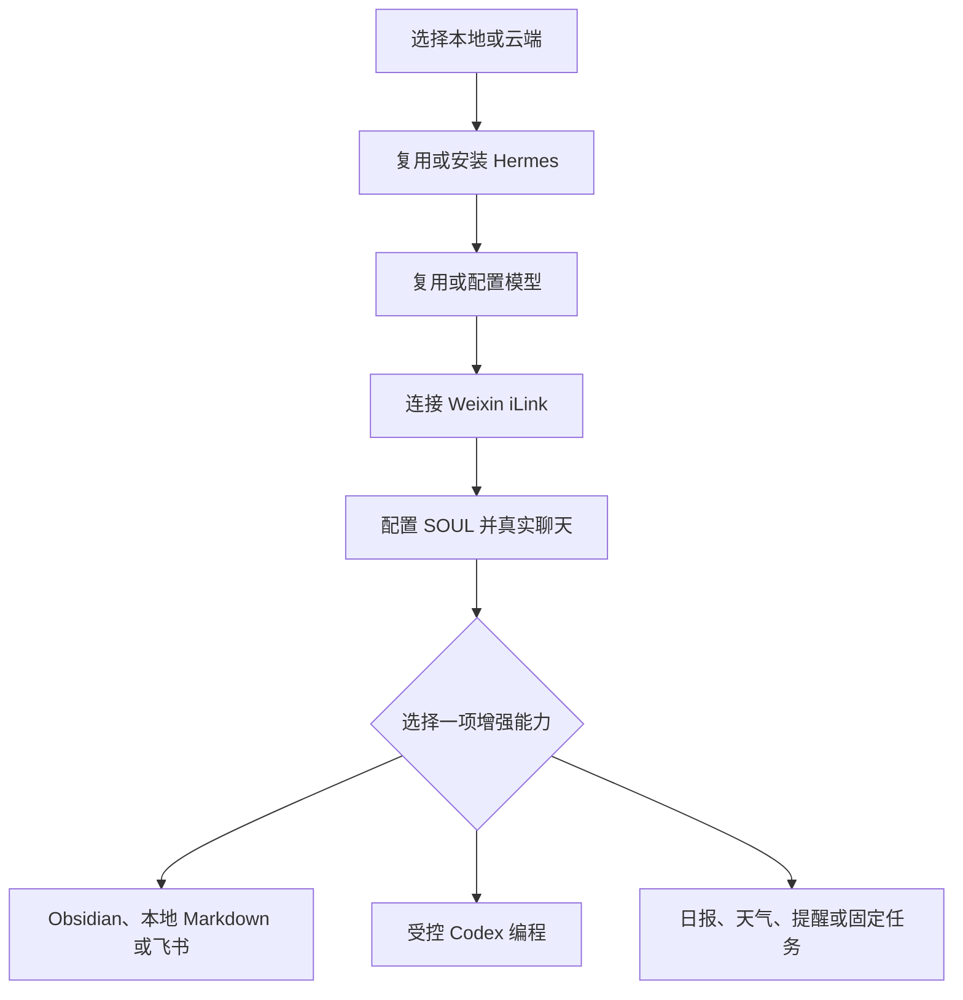

# build-wechat-assistant

用简体中文陪普通用户搭建自己的微信 AI 助手：先完成本地或云端、Hermes、模型、Weixin iLink 与人格五步基础闭环，再按需增加知识库、受控 Codex 编程和日常自动化。

> GitHub 初始版本：**v0.1**；对应内部验收包 **V7.5.15**。版权人尚未选择开源许可证，因此当前仓库必须保持私密；加入正式 `LICENSE` 前请勿改成公开或宣称已经开源。仓库版本唯一来源为 [`VERSION`](VERSION)，MIT 与 Apache-2.0 的选择说明见 [`LICENSE_DECISION.md`](LICENSE_DECISION.md)。

## 它解决什么

- 用户不需要懂终端：Agent 负责检查、安装、配置和验证。
- 第一步先决定本地或云端，避免在错误机器上重复安装 Hermes、模型或微信助手。
- 已有 Hermes 和模型优先复用；配置存在不等于可用，必须以真实回复为准。
- 基础聊天完成后才展示知识库、编程与日报，不提前索要文件或项目权限。
- 知识库默认只读；把本地或飞书内容交给模型，以及创建、更新和回滚，都逐次确认。
- Codex 先在一次性 Git worktree 生成补丁，第二次确认才应用；不默认提交、推送、发布或部署。
- 定时任务必须先手动运行并取得持久回执；只有微信真实收到才算投递通过。

## 流程



## 当前可交付范围

| 能力 | 包内实现 | 默认边界 |
|---|---|---|
| 基础微信助手 | Hermes Agent + 官方 Weixin iLink 适配器 | 单人私聊、许可名单、群聊关闭 |
| 本地知识库 | `scoped_knowledge_mcp.py` | 一个获准目录；先只读；写入可回滚 |
| 飞书知识库 | `scoped_feishu_mcp.py` | 固定文档读取；创建只能写入固定父目录 |
| 编程 | `scoped_coding_mcp.py` | 当前仅交付 Codex；固定 Git 仓库；两次确认 |
| 自动化 | Hermes cron | 固定 Profile、时区、脚本目录和投递目标 |

Claude Code 与 OpenCode 目前只提供比较和检测流程，没有等价受限执行器时不能宣传为已接入。云端助手也不能天然控制本机代码或 Obsidian；跨设备桥接不在本版本交付范围内。

## 平台支持

| 平台 | 当前状态 | 说明 |
|---|---|---|
| macOS | 主要支持 | 本地严格隔离、知识库、受控编程和发布门禁已有自动化证据 |
| Linux | 云端支持候选 | systemd 服务、资源台账和隔离门禁已实现；仍需在目标服务器逐机预检与真实微信验收 |
| Windows | 暂未交付严格门禁 | 缺少与 POSIX 路径、权限、进程隔离等价的实现；不得降级读取或改动已有助手 |

GitHub Actions 只在 macOS 与 Linux 跑包内结构和隔离回归。它不使用私人账号、模型密钥或微信身份，因此不把 CI 通过宣传成真实登录或真实送达。

## 安装

普通用户不需要复制命令。把发布页中的以下四个文件交给支持本地 Agent Skills 的 Codex 或 Hermes Agent：

- `build-wechat-assistant-V7.5.15.zip`
- `SHA256SUMS`
- `FILES.sha256`
- `verify_release_package.py`

Agent 应在全新私有目录核对验证器哈希、ZIP 哈希和逐文件哈希，无覆盖解压后再运行 `skill/scripts/validate_skill.py`。完整接收与宿主发现流程见 [`skill/references/install-skill.md`](skill/references/install-skill.md)。

安装完成后，在 Codex 中输入：

```text
使用 $build-wechat-assistant 帮我搭一个微信 AI 助手
```

Hermes 中使用目标 Profile 新建会话，再输入“帮我搭建微信 AI 助手”。

## 验证状态

- 58 个 Skill 文件的精确清单、结构和跨文件契约通过。
- 600 项隔离回归测试通过且完整门禁无跳过；其中包含一条贯通知识库、飞书和受控编程的整体离线用户旅程，并验证本地受保护模式可先建立三路 TTY 再打开系统隐藏输入框，API key 不进入聊天、命令参数或子进程回传。
- V7.5.11 补齐了微信英文 `Confirm /new` 卡片的逐项中文解释：普通验收推荐一次性 `/approve`，不推荐永久 `/always`；同时明确网关重启会让旧确认失效，恢复后必须重新发送 `/new`，不能把 `Gateway shutting down` 当成成功。完整回归的外层超时也从 60 秒改为 180 秒并失败关闭，避免测试仍在正常运行时被验证器误判。
- V7.5.12 在 Codex MCP 启动时机械检查当前 CLI 是否仍具备受限工作区、禁止自动批准、临时会话、忽略用户配置和固定工作目录等安全参数；旧版或不兼容 CLI 会在读取项目之前停止，不会悄悄降级为宽权限执行。专用 `CODEX_HOME` 只读或状态库不可写时，错误提示会直接说明发生了什么、检查哪个目录和怎样恢复，不再误导用户反复登录或重输 Key。
- V7.5.13 根据真实隔离验收网关启动失败继续修复 npm 版 Codex：终端里的 `codex` 实际可能是 `#!/usr/bin/env node` 脚本，而隔离 Gateway 不继承用户 `PATH`。执行器现在识别这类入口，未显式绑定 Node.js 时给出准确恢复；Agent 必须执行 Node 版本与身份探针并传入真实绝对路径。修复后隔离验收助手的知识库、飞书、Codex 三路 MCP 同次启动全部注册成功。
- V7.5.15 补齐“用户目前没有知识库”的可执行路线：Agent 经同意后只能新建一个原本不存在、权限为 `0700` 的空 Markdown 资料库，已存在即拒绝，且不会在资料库日后被移动时静默重建。受控 Codex 的任务记录改为原子替换；应用或回滚后若记录写盘失败，会先把项目自动恢复到与旧记录一致的状态，避免项目与回滚凭据分叉。全新 Hermes 安装还会区分网络下载失败、核心 CLI、可选依赖和锁文件哈希降级；重新从 PyPI 解析依赖可以继续做功能验证，但不得冒充可复现的严格供应链通过。
- Hermes v0.20.0 的 CLI、Cron 与 MCP stdio 重连通过；发布门禁会实际执行指定 Node.js 的 `--version` 和 JavaScript 身份探针，拒绝 `/bin/sh`、只会伪造版本字符串的脚本等任意可执行文件冒充 Node，并在真实 Node v22.23.2 下完成三类 MCP 的发现、保存与重连。
- 知识库 6、飞书 2、编程 5 个 MCP 工具在全新 Profile 中可发现。
- 本地知识库已在真实模型层完成读取、创建和回滚；Hermes 确认菜单返回 `accept` 但内容为空时曾被旧执行器误判失败，V7.5.7 已修复并用该真实返回形式回归。V7.5.11 又从隔离助手实际保存的 MCP 配置发现 6 个工具，完成 6 次确认回调、创建、更新、两级回滚和逐字节恢复；V7.5.15 另从“没有知识库”起点完成新空目录初始化、只读连接、写入和回滚旅程，并证明重复初始化不会覆盖已有资料。微信入站触发知识库操作仍需单独取得真机回执。
- macOS 上已用登录态 Codex CLI 对全新临时 Git 仓库完成真实“准备、二次应用、测试、回滚”；准备阶段未改原项目，回滚后内容逐字节恢复且 Git 状态干净。V7.5.10 进一步区分 Codex 桌面应用与 CLI 登录：当用户全局配置已固定 DeepSeek 等自定义模型或 API 登录时，不覆盖原配置，而是为当前助手创建权限为 `0700` 的专用 `CODEX_HOME`，通过官方页面登录并由 MCP 显式绑定。V7.5.15 又从隔离助手实际保存、已显式绑定 Node.js 的 5 工具 MCP 完成 3 次确认回调、真实 Codex 准备、检查、应用、测试和回滚；准备时原项目不变，回滚后内容逐字节恢复且 Git 干净，没有提交或发布。任务记录写盘失败的应用与回滚两条自动复原路径也已故障注入通过。每次准备任务仍会重新读回登录状态，不在聊天索取秘密。
- 已用隔离 Hermes 根内的独立飞书应用、命名 Profile 和包内单文档白名单读取器真实读取授权文档；越界文档在联网前拒绝，正文、ID 和密钥均未输出。账号本人已在飞书官方页面批准 `docx:document:create`；V7.5.10 又在锁定的个人文档库真实创建一篇无私人内容的验收文档并读回校验，未输出链接或文档 ID。V7.5.15 再从当前保存的固定白名单完成真实只读复验并取得 `LIVE_READ_OK`，仍未输出正文、链接、文档 ID 或凭据；创建执行器与已经真实验收的版本逐字节一致，本轮未重复创建外部文档。实际保存的飞书 MCP 精确发现读取、创建 2 个工具，并完成越界读取和无效创建两次确认后的联网前拒绝，没有调用外部服务。
- 真实 DeepSeek 模型已选择正确的飞书读取工具；Hermes v0.20.0 经典 CLI 的 MCP elicitation 从后台线程发起时拿不到 prompt-toolkit 审批回调，会按设计快速拒绝，因此没有把 CLI 失败冒充模型层成功。Gateway 的同界面审批实现已由包内测试覆盖，但微信入站的真实飞书问答仍需在原微信请求中确认后取得回执；私人正文没有在本轮测试中发送给模型。
- 飞书与 Codex 运行期错误已覆盖“权限缺失、登录失效、额度不足、专用目录不可写和未知失败”：只返回白名单内的 scope 名称或中文恢复步骤，不回传 CLI 原始输出、token 或未知字段，且失败时原文档或主项目保持不变。Codex 在 MCP 启动时检查安全参数契约，并在每次准备任务前重新读回登录状态；任一项无法核验都不会创建 worktree。
- 已在隔离 Profile 完成 Cron 正向、失败、路径越界、暂停、恢复和移除测试；失败脚本留下 `failed` 持久回执，不会冒充日报成功。首条临时日报的真机回执暴露 Hermes 默认英文外层；设置并读回 `cron.wrap_response=false` 后，V7.5.10 二次任务取得 `completed` 与 iLink 投递回执，用户截图确认微信只显示中文正文。任务、脚本均已删除，当前零残留。
- GitHub Actions 使用官方 `checkout`、`setup-python` 的 v7.0.0 完整提交 SHA、只读仓库权限和禁用凭据持久化；macOS/Linux 每次 CI 都会重放“构建 ZIP → 把验证器移到制品目录外并先核对自身哈希 → 验真无覆盖解压 → 从接收者副本再次验证”，Dependabot 每周检查 Actions 更新。
- 发布 ZIP 可复现构建，并通过无覆盖解压、危险条目和双清单验证。V7.5.15 按陌生接收者流程把独立验证器放在制品目录之外，先核对验证器自身哈希，再从全新私有目录解压、全量验证并链接到全新 Hermes 0.20.0 Profile；14 项新鲜性检查全部通过，`skills list --enabled-only` 实际显示该 Skill 为 `local / enabled`。

这些证据不等于不同操作系统的真实安装、私人知识内容处理或微信端增强能力投递已经全部现场通过。Skill 会逐层登记证据，不用模拟结果冒充真实送达。

## 安全

不要在 Issue、聊天、截图或日志中提交 API key、微信 token、二维码、Cookie、`.env`、真实用户 ID、私人文档或绝对个人路径。安全问题请按 [`SECURITY.md`](SECURITY.md) 私下报告。

## 参与贡献

修改前请阅读 [`CONTRIBUTING.md`](CONTRIBUTING.md)。Skill 文件树保持最小化：不要向 `skill/` 添加 README、变更日志或发布材料；仓库说明和社区文件放在仓库根或 `.github/`。

维护者公开仓库前必须逐项完成 [`RELEASE_CHECKLIST.md`](RELEASE_CHECKLIST.md)。本地候选包、CI 和公开 Release 下载属于不同证据层，不能互相替代。

## 许可证

尚未选择。只有版权人加入 OSI 认可的正式许可证后，项目才具备允许他人使用、修改和再分发的开源授权。
