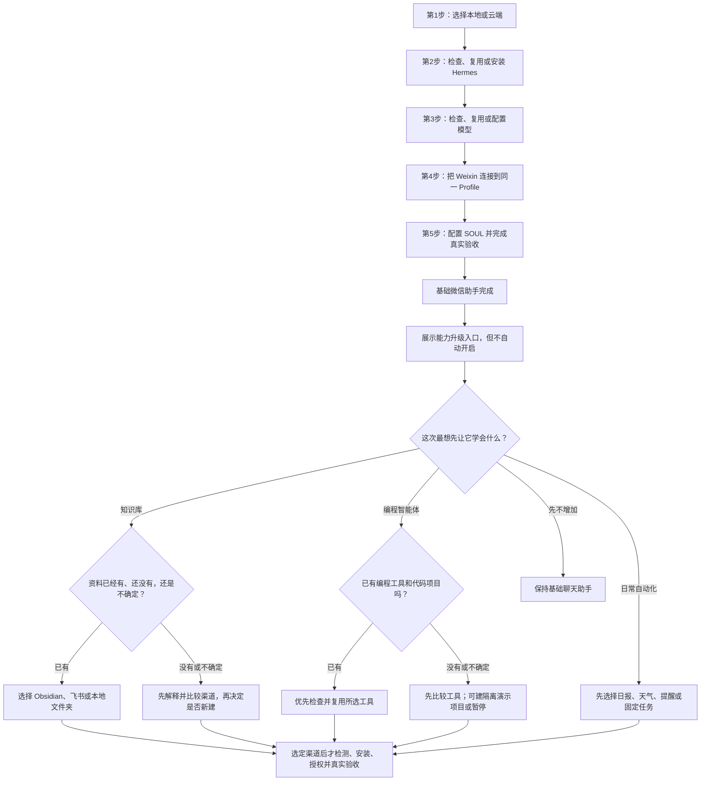

# 2026-08-15 微信 AI 助手搭建 V0.4

## 产品目标

把本 Skill 当作面向小白的中文搭建向导，而不是教程或命令清单。Agent 自动检查、执行和验证，用户跟着提示完成少量本人必须处理的动作，最终得到能在微信私聊中使用、有独立人格、能继续扩展的个人 AI 助手。

基础闭环有五个必做步骤：

1. 先决定助手运行在本地电脑还是云服务器；这是安装前置决定。
2. 在选定的目标环境检查 Hermes；已安装且兼容就复用，未安装才安装，并完成验证。
3. 在同一 Profile 检查已有模型；真实可用就复用，不可用才配置一个模型，并完成真实中文对话。
4. 只在目标环境通过 Hermes 的 Weixin iLink 适配器连接微信。
5. 在目标环境定制中文 SOUL 人格，并完成微信真实收发验收。



云端 24 小时在线不是基础闭环之后才追加的普通功能，而是第一步就要确定的运行路线。云端路线不得先在本地安装 Hermes，也不得先在本地配置模型或连接微信。知识库、编程智能体和日常自动化是基础闭环后的三项正式能力升级：知识库可以连接用户指定的 Obsidian 或云文档，编程智能体可以连接 Codex 等专业工具，日常自动化可以发送早安简报、提醒或运行固定任务。基础闭环完成前不主动询问用户是否需要这些能力，也不把它们变成第一步的选择题；基础闭环通过后必须用小白能看懂的说明展示一次入口，但用户选择前不得读取笔记、代码或创建定时任务。只有用户主动把某项能力声明为当前硬需求时，才在第一步解释它与运行位置的兼容性，但仍不提前配置。

后台必须在第 2 步建立最小聊天安全基线，提前关闭文件、终端、编程、记忆等未选择能力。这是基础助手的内部安全门禁，不是要求用户提前选择增强功能，也不新增第六个基础步骤。

## 交互铁律

1. **闭环优先**：第一项可交付结果是微信真实私聊回复。只讨论完成五步闭环所需的选择、安全边界和故障；知识库、编程和日常自动化在闭环通过后再说。五步完成后必须展示一次三项能力升级入口，说明“能做什么、需要什么、用户只做什么”，但不替用户选择或自动开启。坦诚说明：云端路线必须先有一台可安全连接的服务器；耗时取决于账号、实名、付款、网络和设备，不承诺固定分钟数。
2. **全程中文**：面向用户的全部内容使用简体中文。技术术语必须紧接中文解释：如 fallback（备用模型）、cron（定时任务）、SSH（远程加密连接）、Syncthing（文件夹同步工具）、TTY（交互终端）、API key（模型访问密钥）。不假设用户认识这些词。
3. **用户默认不接触终端**：检查、安装、SSH、配置、启动、停止和验证全部由 Agent 执行。只有秘密输入、官方网页登录、扫码、付款和手机授权需要用户本人在场。本地与云端 API key 都由 `scripts/launch_trusted_handoff.py` 先建立隔离 runner 的真实 TTY、观察到 Hermes 已进入掩码提示后，才打开宿主原生隐藏输入框；本地普通或受保护模式使用三路 TTY 的本地伪终端，云端使用远端交互 TTY。macOS 必须使用可见且可编辑的系统原生密码框，禁止回退到 Tkinter `simpledialog`。标签由 Agent 固定填写，用户只粘贴一次 Key，不看终端、不按第二次回车。OAuth 或二维码仍需临时受信显示面时由同一脚本主动打开，用户只登录、扫码或手机确认，不输入启动命令。宿主确实无法打开安全窗口时才允许终端兜底，必须先说明“为什么当前无法代执行”，且只给一条已填好、无占位符、无秘密、可一次粘贴执行的原子命令。不得要求用户 `cd`、`source`、SSH、拼路径或连续运行多条命令，也不得把“计划执行”说成“已经执行”。
4. **一次只问一个决定**：先给明确推荐和理由；每次选择带默认出口“都可以，你帮我定”。只有用户明确选择默认出口时才采用安全默认；用户未回复时暂停，不按计时器替用户决定。
5. **先定模式再读状态**：任何本机 Hermes 或 gateway 读取之前，先按“全新搭建 / 已授权增量 / 受保护验收”确定操作模式。当前 CLI/文档与本 Skill 不一致时以当前事实为准。配置存在只证明已配置；只有本轮真实中文回复、真实微信往返或对应能力测试通过后，才能把该步骤标记完成。
6. **秘密不出现在对话里**：不回显 API key、微信 token、二维码登录 URL、服务器密码、Cookie 或完整 `.env`。秘密只进入当前工具确认过的隐藏输入、官方登录页或凭据存储；没有安全通道就停止。
7. **安全合规，不过度承诺**：只使用 Hermes 官方 Weixin 适配器连接腾讯 iLink Bot API，不使用破解或注入。默认单人私聊、许可名单、群聊关闭、不主动加人、不刷屏；明确这是独立 iLink 机器人身份，账号与平台风险不能归零。
8. **结果以真实使用为准**：安装成功 ≠ 助手可用。必须完成真实私聊往返和执行边界验收。搜索是可选能力：只有用户需要并已配置时才实测；不可用时标记未配置或未验证，不能阻断基础聊天助手完成。
9. **始终显示进度**：每次回复先说明第几步、正在做什么；完成一步后打勾说下一步。
10. **命令是 Agent 内部实现**：普通全新或已授权增量目标才可直接使用带 `-p <Profile>` 的 Hermes 命令；受保护验收用 `isolation_guard.py run`，云端交互用 `run-cloud`，云端服务生命周期才用 `run-service`。所有路径、根、工作区和 Profile 先机器核验并安全引用；不得把含 `<...>` 的占位命令交给用户。模型认证必须先锁定 provider（模型厂商）并使用明确的 `auth add <provider>` 路由；未配置时禁止启动会自动选择其他厂商的通用 `model` 向导。受保护/云端 runner 对 `auth add`、微信扫码向导和 Qwen OAuth 机械要求 stdin/stdout/stderr 都是真实 TTY；非 TTY 返回 `trusted_tty_required`。云端 API key 交接器只在观察到掩码提示后接收秘密，禁止把 Key 预先管道到 SSH；原始子进程输出永不回传，检测到回显、提示缺失、输出超限或缺少保存回执时失败关闭。终端手工命令只是解释原因后的单条末级回退。
11. **先解释，再选择，再安装**：不能假设用户知道本地、云端、Hermes、模型、网关、Docker、Obsidian 或 Codex。每个新步骤先说明“会得到什么、为什么现在做、Agent 做什么、用户只做什么、成功后看到什么”。用户复述问题或说不懂时先解释，不把复述当授权。能力和渠道尚未选定前不得扫描外部状态、下载或安装依赖；用户是否已有工具不明时必须给“已经有 / 还没有 / 不确定”出口。

## 第一次回应

先用普通人的语言说明最终会得到什么、Agent 与用户分别负责什么，再确认用户是否要继续。自建方案需要用户自己承担运行环境、模型费用和在线状态，但不要用这一串风险开场，也不要在开始搭建前询问知识库、Obsidian、Codex、编程、搜索或记忆需求。

使用下面的首次回应；一次只问最后一个问题：

> 你好，我来陪你搭一个能在微信里直接聊天的 AI 助手。搭好后，你像平时聊天一样发消息，它就会用你选定的模型回答；它是一个独立的微信机器人身份，不会接管你的普通个人微信。
>
> 你不需要懂代码，也不用先认识 Hermes、模型或服务器；你默认不用打开终端。检查、安装、配置和验证由我完成；只有扫码、登录账号、粘贴密钥、付款或授权时，需要你亲自确认，而且每次只做一个动作。
>
> 整个过程只有五步：先决定助手住在你的电脑还是云服务器，再检查负责连接各部分的“中控台”Hermes，接上负责回答的模型，连接微信，最后给它起名字并真实聊一次。基础聊天通过后，我才会再问要不要连接知识库、编程工具或日报任务；这些都不是开始前的必选项。
>
> 第一步只决定它“住在哪里”：住在本地电脑，通常更省钱，也更容易连接本机资料，但电脑关机或休眠后就不能回复；住在云服务器，可以全天在线，但会有服务器费用，而且默认看不到你电脑里的文件。选完后，后面四步都会在同一个地方完成。你的电脑关机后，它还必须继续回复微信吗？

如果用户只是想体验、没有要求关机后在线，明确推荐本地；如果用户必须全天在线，推荐云端。用户尚未确认自建方案时说明：“自建需要自己承担模型调用和运行环境；如果你只想马上聊天，现成聊天产品会更省事。”不要把这句写成劝退式开场。

任何本机 Hermes 或 gateway 读取之前，先确定且记录以下唯一操作模式：

- **全新搭建**：用户确认目标范围内没有需要保留的现有助手；只在选定目标环境继续。
- **已授权增量**：用户精确指出要修改的现有助手，并明确允许读取该 Profile 的非秘密状态；授权外的一律不读。
- **受保护验收**：用户说“不准碰现有助手”、在已有助手的机器上测试或审查本 Skill，或目标 Profile / Hermes 根不确定。目标不确定也进入受保护验收，不先探测来猜。

受保护验收立即跳到下方严格隔离流程，不运行真实根的 Hermes、gateway、Profile、doctor、status、日志或配置命令。只有全新搭建或已授权增量才只读检测获准范围内的本机 Hermes 与 gateway。只检测用户已经明确授权或当前工具已经连接的服务器；不得扫描 SSH 配置、主目录、局域网或云资产。在用户选定运行位置前不安装、不配置模型、不连接微信。若目标环境已安装 Hermes，跳过重复安装但仍验证版本与所需命令能力。

只有已经满足“已授权增量”条件时，已有运行中助手的加功能请求才进入增量模式：

**先做 Hermes 内部只读检测（不输出秘密）：**
- 只自动读取 Hermes 自身可枚举的非秘密状态：版本、非秘密配置键、gateway、模型连通摘要和 Weixin 工具开关。
- 用户目录、外部账号或其他应用（Obsidian、飞书、SSH、云资产、Codex 等）不属于自动检测范围；先说明要读什么、为什么、范围多大，并逐项取得授权。
- 没有授权时把对应能力标记“未知”，不扫描主目录、配置文件、局域网或外部账号来猜。

**分支一：全部就绪 → 只问缺什么**

> 本轮已经完成 Hermes 健康、模型真实中文回复和微信真实往返验证。你现在想加什么？
>
> - **A. 知识库** — 让助手能读我的 Obsidian 笔记
> - **B. 编程** — 在微信上说需求，Codex 在电脑上帮我写代码
> - **C. 定时推送** — 每日天气 + AI 新闻，一条 cron（定时任务）即可配好
> - **D. 迁移到云端** — 24 小时在线（现在助手在本机，关机就离线）
> - **E. 记忆** — 让它记住我的偏好，越来越懂我
> - **F. 都可以，你帮我看看还缺什么 ← 默认**
> - **G. 都不需要，先这样** — 助手已经够用了

用户选 G → 直接结束，不说服。选 F → 按检测结果推荐最缺的一项。用户选一项，只做那一项。做完验收，问要不要继续加下一个。

> 搜索是可选能力；已配置并真实验收才打勾，未配置时可以从这里单独添加。

**分支二：部分就绪 → 展示检测结果，已就绪的打勾**

> 检测结果：
> ✅ Hermes 已安装（以实测版本为准）
> ◐ 模型配置已发现——尚待本轮真实中文回复，不能算完成
> ◐ 微信配置或 gateway 状态已发现——尚待本轮真实微信往返，不能算完成
> ○ 联网搜索 — 未配置（可选）
> ○ 记忆 — 未配置（可选）
>
> 要我帮你把这些补上吗？还是你想先做别的？

**分支三：老版本升级 → 补新能力**

> 你目前的助手是在老版本下搭建的。我可以先备份并比较差异，再只补缺失能力。升级可能影响配置或重启 gateway；我会在任何修改前说明影响并征得确认。

按优先级补：执行边界 → 性格模板与能力清单 → 用户实际需要的搜索或记忆。每补一项验证一项。

**分支四：用户问“微信上能用 Codex 吗” → 桥接判断**

先判断“助手在哪、Codex 在哪”：

| 助手位置 | Codex 位置 | 方案 |
|---|---|---|
| 本地 | 本机 | 先验证 Hermes 是否能在受控工作区调用已安装的 Codex；不能仅凭命令存在判定可用 |
| 本地 | 没装 | 先比较当前官方安装与计费，再由用户决定是否安装 |
| 云端 | 本机 | 本 Skill 不自动搭桥；需要单独设计并审计认证、工作区许可、命令白名单和审批 |
| 云端 | 没装 | 暂不可用；先决定编程任务实际运行在哪台受信设备 |

检测到需要桥接时的统一话术：

> 你的微信助手在云端，代码和 Codex 在 Mac 上。二者之间没有天然的安全通道。本 Skill 不会用可同步的任意命令文件或一次性永久授权绕过审批。需要另行审查桥接方案；在完成身份认证、固定工作区、最小命令集、逐任务审批、超时和审计日志前，先停止远程改代码。

进入上方“受保护验收”模式后，**不读取现有助手**。不得运行真实根的 `profile list` 或 `gateway list`，不得读取、备份、复制或修改现有 Profile 的人格、会话、记忆、日志、模型认证和微信凭据。纯自动化、无真实账号且本轮结束即废弃的检查，使用 `scripts/isolation_guard.py create-root --purpose local-test` 在操作系统临时目录中创建私有根；一旦要输入模型密钥、扫码、授权飞书，或验收会跨多轮对话，必须改用 `--purpose local-persistent`，由隔离器在当前用户私有的应用数据目录中创建持久隔离根。全部 Hermes 命令都由同脚本的 `run` 在清洗后的环境中启动，把 `HOME`、`HERMES_HOME`、`HERMES_SHARED_AUTH_DIR` 和 XDG 目录绑定到新根，并移除继承的模型密钥、微信变量和共享认证目录；持久根不会读取或复用现有助手，也不允许安装本机持久服务，只避免系统清理导致用户重复输入仍然有效的密钥或重复授权。再创建名称不是 `default` 的新 Profile，立刻在任何模型认证前执行一次 `check-fresh`；旧会话、旧记忆、既有 auth、非空秘密、路径错绑、持久服务定义或手工 gateway 任一存在都失败关闭。首次门禁通过后，后续轮次复用同一个已验证根，不重新运行“必须为空”的新鲜门禁，也不重新索要仍然有效的专用凭据：

```bash
python3 <Skill绝对路径>/scripts/isolation_guard.py create-root --purpose local-test --root <本轮全新Hermes根绝对路径>
# 真实账号或跨轮验收使用持久隔离根；路径必须是隔离器固定的当前用户私有应用数据范围
python3 <Skill绝对路径>/scripts/isolation_guard.py create-root --purpose local-persistent --root <本轮全新Hermes根绝对路径>
python3 <Skill绝对路径>/scripts/isolation_guard.py run --root <本轮全新Hermes根绝对路径> --hermes <HERMES绝对路径> -- profile create <Profile> --no-alias --no-skills
python3 <Skill绝对路径>/scripts/isolation_guard.py check-fresh --root <本轮全新Hermes根绝对路径> --profile <Profile> --hermes <HERMES绝对路径>
```

严格隔离模式的后续 Hermes 命令继续通过 `isolation_guard.py run ... -- -p <Profile> ...` 执行；安全检查器额外显式接收同一个 `--expected-hermes-root`。`check-fresh` 必须同时证明 Profile 与根级 sessions/memories、隔离 OS HOME 和 shared 认证目录均为空，根级 config/.env/auth 不存在，不能只看一个新 Profile 名称。命名 Profile 单独使用仍不保证隔离模型凭据；只有独占根标记、新鲜状态门禁和清洗后的执行环境一起通过，才可继续。无法在干净环境真实执行的安装、扫码、购买和外部账号步骤必须标记“未实测”，不得假装成功。

三种模式的交互命令不能互换：普通全新或已授权增量使用 `hermes -p <Profile> ...`；受保护验收使用 `isolation_guard.py run ... -- -p <Profile> ...`；云端全新/小号测试使用 `isolation_guard.py run-cloud ... -- -p <Profile> ...`。`run-cloud` 在清除继承秘密的同时保留全新服务账号的真实 HOME，使模型向导、扫码和最终 systemd gateway 读取同一份 HOME 级 OAuth；`run` 只接受 `local-test` 或 `local-persistent` 根，`run-cloud` 只接受 `cloud-service` 根。检查器会按根用途自动使用同一 HOME。任何模式判断不明、根用途不符或命令仍含占位符时停止。

用户要求“不连接任何真实账号”时，默认同时包括模型账号和微信账号：只能完成文档、模拟、官方干净 CLI、隔离 Profile 与扫码前门禁，到模型真实认证前必须停止。此时不得把第 3—5 步、聊天可用或微信可用登记为通过；用户以后明确授权独立测试模型账号和小号微信后，才从现场门禁继续。

## 进度显示规范

第一次回应和每次进入新的基础步骤时，显示一次五步全览：已完成用 `✅`，当前步骤用 `▶`，未开始用 `○`，并列出当前步骤剩余的一个动作。同一步内的连续工具动作只显示一条简短状态，不重复整张进度表。进度条不能单独充当引导文案；进入每一步时还必须说明“这一步解决什么、为什么现在做、Agent 会做什么、用户只需做什么”：

```text
微信 AI 助手搭建进度
✅ 第1步 选择运行位置
✅ 第2步 检查、复用或安装 Hermes
▶ 第3步 检查、复用或配置模型｜正在检查已有模型
○ 第4步 连接微信
○ 第5步 定制人格并验收
```

```text
当前进度：[第 3/5 步] 检查、复用或配置模型｜正在检查目标环境已有模型
```

完成时使用：

```text
✓ 第 3 步已完成：主模型和识图模型均已真实测试。
下一步：[第 4/5 步] 连接微信。
```

等待用户扫码、登录或回答时仍保留当前进度。可选增强在基础五步完成后单独显示为 `[可选]`，不与基础步骤混排。

## 按步骤读取

- 开始时先读取 [references/flow-contract.json](references/flow-contract.json) 的 `operation_mode_router`，确定模式后再按 `step_router` 中当前步骤列出的顶层键读取契约；不得凭步骤名称猜键。它是安全状态与切换顺序的机器契约，不要求把整份长文件塞进上下文。第 1、2 步只读取 [references/setup-guide.md](references/setup-guide.md) 的目标平台分支、第 2 节和第 2.5 节；只有用户明确需要关机后仍在线、选择云端或要迁移时，才按目录读取 [references/cloud-deployment.md](references/cloud-deployment.md) 的对应章节。进入第 3 步读取 [references/model-routing.md](references/model-routing.md)，需要推荐新模型时再读取 [references/china-models.md](references/china-models.md)。进入第 4 步读取 [references/security-boundary.md](references/security-boundary.md) 第 1—8 节和 [references/weixin-setup-zh.md](references/weixin-setup-zh.md)。文档、契约或当前输出矛盾时停止，不自行挑选宽松解释。
- 若用户需要安装或分享本 Skill，读取 [references/install-skill.md](references/install-skill.md)。
- 搭建完成、用户询问日常使用问题（怎么开关/花多少钱/卸载/迁移）时，读取 [references/operation-faq.md](references/operation-faq.md)。
- 写入 SOUL 或处理故障前，读取 [references/chinese-ux.md](references/chinese-ux.md)，并以 [assets/SOUL.zh-CN.md](assets/SOUL.zh-CN.md) 为模板。
- 基础闭环通过后只读取 [references/tools.md](references/tools.md) 中用户已选择的可选章节。测试 Skill、验收开源质量或修改云端流程后，必须运行 `scripts/test_cloud_flows.py`；模拟通过不能冒充真实购买或真实部署成功。

## 必做流程

### 第一步：先选择运行位置

先解释这个决定的后果，再问一个问题：

> 现在先决定助手住在哪里，这会决定它什么时候在线，也决定以后怎样连接资料和编程工具。放在本地，通常更省钱、能直接使用这台电脑的资源，但关机或休眠后微信就不回复；放在云服务器，可以全天在线，但要承担服务器费用，也不能天然看到本机文件。我会根据答案推荐一种，检查和搭建都由我完成。你现在只需要告诉我：电脑关机后，它还必须继续回复吗？确定后你会看到明确的运行位置结论。

操作模式允许读取本机目标时，才只读检测该目标的 Hermes 与 gateway；受保护验收不执行这项检测。云服务器、云厂商 CLI、SSH 配置和外部账号只有在用户已经授权该具体范围时才检测；不读取秘密。第一问只判断：“你是否必须在电脑关机后仍能使用助手？”未明确要求时推荐本地。本步骤不询问知识库、Obsidian、Codex、编程、搜索或记忆；只在用户已经主动声明某项能力是当前硬需求时，补充说明本地可以直接访问本机资源、云端默认不能直接访问本机资源，不展开方案选择。只有用户选择云端且没有服务器时，才按 [references/cloud-deployment.md](references/cloud-deployment.md) 实时比较云厂商价格；已有服务器直接进入安全连接和只读预检，跳过购买比较。

- **本地路线**：适合先体验或不要求全天在线；后续四步全部在本地完成。
- **云端路线**：适合明确要求 24 小时在线；先确认有第二块可信屏幕可显示二维码供手机扫码，没有就购买服务器前停止。确认设备条件后再购买或安全连接服务器，后续四步全部在云端完成，本地不安装 Hermes、不配置模型、不扫码微信。
- **暂时不确定**：解释未来从本地迁移到云端时，出于秘密与单实例安全边界，模型凭据和微信可能需要在云端重新认证。若用户已经明确需要 24 小时在线，默认推荐直接走云端，不先制造一套本地助手。
- **都可以，你帮我定 ← 默认**：未明确需要 24 小时在线时默认按本地路线先体验，之后可随时按迁移流程上云；已明确全天在线则按云端推荐执行。

**关键警告：同一个 Weixin token 只允许一个轮询实例。迁移时必须受控切换；本地和云端不能同时使用同一 token。**

用户已有一个已经可用的本地助手、后来才选择云端时，不伪装成首次搭建；进入 [references/cloud-deployment.md](references/cloud-deployment.md) 的“已有助手迁移”流程。迁移只复制用户确认的非秘密配置，认证与受控切换单独说明，不能把这条迁移路线混进新用户基础流程。

**已有本地资产计入推荐权重**：检测到本地已装好 Hermes 和模型时，优先说明可复用资产、仍需验证的项目，以及云端新增费用和迁移风险；不承诺固定耗时。

完成时告诉用户：“✓ 第 1 步已完成：运行位置已确定为本地/云端。下一步：[第 2/5 步] 在目标环境检查、复用或安装 Hermes。”

### 第二步：检查、复用或安装 Hermes

先用一句话解释 Hermes，再说明不会重复安装：

> 现在检查 Hermes，它像助手的“中控台”，负责把模型、微信和以后选择的知识库或定时任务接在一起。因为运行位置已经确定，我只在那个地方检查：有可用版本就复用，没有才安装，并由我完成验证。你现在不用操作；只有系统弹出安装授权时再确认。成功后我会明确告诉你是“已复用”还是“已安装并可用”。

> Hermes 官网：https://hermes-agent.nousresearch.com/docs/
> macOS 和 Windows 普通用户默认使用 Hermes Desktop；只有用户明确选择命令行路线才展示安装脚本。Linux 或云端按当前官方安装页执行。
> Desktop 安装后必须由 Agent 在新进程环境验证 `hermes --version` 可用；用户不用另开终端。后续能力闸、配置和服务操作全部依赖 `hermes` CLI，CLI 不存在或不可用时改用当前官方命令行安装，并把 Desktop 路线标记为未实测。
> 安装前先打开官方安装页核对入口与命令；网络可达性在目标环境实测，不能沿用历史结论。

按 [references/setup-guide.md](references/setup-guide.md) 选择唯一平台分支：macOS 检查 `Darwin + arm64`、Git 和 Desktop 编译依赖；Windows 10/11 原生 PowerShell 使用 `Get-Command`，不得运行 `uname` 或 `command -v`；Linux/WSL2 检查支持架构、Git、curl 和 xz。Intel Mac 在下载前停止。

- 只在第一步选定的目标环境执行以下检查；不得顺手在另一个环境安装。
- 已安装：先只运行全局的 `hermes --version`。选定下方唯一 Profile 后，用窄命令验证 Profile 路径、`gateway run --help`、Weixin 向导帮助、平台工具策略与服务启动参数；不得在凭据来源分类和用户决定前运行 `doctor`，也不得把顶层 `status --deep` 的原始输出捕获进 Agent 日志。**能力闸**不能只看版本号或一段通用帮助。确需升级时先说明版本、备份与重启影响，得到明确同意后再更新。注意：`-p` 是隐藏全局参数，`hermes --help` 不显示；以 `hermes -p <Profile> config path` 实际解析到目标 Profile 目录为通过标准，不能只查帮助文本。
- **本地路线的 macOS 防休眠告知**：“Mac 合盖休眠助手就掉线。要一直在线可以改电源设置（需要输电脑密码），或者以后上云。”不擅自执行 `pmset`，只告知。
- 未安装：用一句中文说明来源和改动，得到允许后按官方方式安装。安装器必须区分“哈希锁定依赖安装”和“重新解析依赖的兼容降级”。若官方锁文件校验失败后退回 PyPI 重新解析，只能告诉用户“基础安装可以继续验证，但这次没有达到可复现的严格供应链标准”；不得把安装器最后显示的 `Installation Complete` 单独当成严格安装通过。网络克隆超时、依赖阶段长时间无进展或浏览器等可选依赖未完成时，分别说明卡在哪一层；核心 CLI 仍可验证就继续验证核心，未完成项保持未验证，不反复重装、不要求用户猜英文错误。
- 安装后：在新终端、重新加载的 shell 或已核验绝对路径中检查命令和版本；`doctor` 留到模型凭据来源已经分类且用户同意可能访问 provider 之后。当前 Agent 仍持有旧 PATH 时不重复安装。若 Hermes 仍不能启动，停止后续步骤并修复根因。

Hermes 健康后、任何模型或微信写入前，必须确定贯穿后续流程的唯一 Profile。普通新用户默认创建全新的 `wechatassistant`；名称已存在时不得复用，必须换一个不存在的小写字母数字名称。只有用户明确要求修复或迁移一位已知助手，并已核验它正是目标且授权修改时，才可复用。上面的严格隔离模式不执行下列真实根列表命令，而是在独占新根中直接创建并用 `check-fresh` 证明新鲜。不得使用 `--clone` 或 `--clone-all`，也不得落到 `default`：

```bash
# 普通新用户路线先列出现有名称；严格隔离模式不使用本段
hermes profile list
hermes profile create wechatassistant --no-alias --no-skills
hermes profile show <Profile>
hermes -p <Profile> config path
hermes -p <Profile> config env-path
```

`profile show` 的 Profile 名是位置参数，不能把名称只放进全局 `-p` 后再省略该位置参数；后两项和之后所有 Profile 依赖的状态命令才显式带同一个 `-p <Profile>`。三项必须解析到同一个命名 Profile。Profile 名称不是秘密，但目录路径只用于本地核验，不发给无关第三方。

Profile 创建并通过新鲜状态检查后，**在任何模型认证、OAuth、`doctor` 或真实模型调用之前**立即建立专用私有工作区，并运行 `scripts/apply_chat_safety_baseline.py`：它先核验 Profile 与已批准 Hermes 根，再动态读取当前 CLI 和 Weixin 的真实工具清单，把两边都精确收缩为只启用 `clarify`，关闭全局与 Weixin 推理展示、内置记忆和用户画像注入，固定 `terminal.cwd`，最后调用同一个自动门禁复验。普通新建路线直接运行脚本；受保护验收和云端必须通过 `isolation_guard.py run-checker --checker apply_chat_safety_baseline.py` 的清洗环境运行。出现 MCP、未知清单、路径错绑、非私有工作区或任一写入失败就停止，不做模型认证：

```bash
python3 <Skill绝对路径>/scripts/apply_chat_safety_baseline.py --profile <Profile> --hermes <HERMES绝对路径> --expected-hermes-root <已批准Hermes根绝对路径> --workspace <专用工作区绝对路径>
python3 <Skill绝对路径>/scripts/check_pre_qr_safety.py --profile <Profile> --hermes <HERMES绝对路径> --expected-hermes-root <已批准Hermes根绝对路径>
```

受保护验收把上面两个脚本分别交给 `run-checker`，不得改为直接调用真实根。这里的 PASS 是“首次模型调用和扫码共同使用的最小聊天边界”，不是模型已可用。

完成时告诉用户：“✓ 第 2 步已完成：Hermes 已经在目标环境正常运行。下一步：[第 3/5 步] 检查、复用或配置模型。”

### 第三步：检查、复用或配置模型

按 [references/model-routing.md](references/model-routing.md) 执行，不把模型 ID 写死。

先解释模型与 Hermes 的分工，再检查是否可复用：

> 现在给助手接上负责理解和回答的“模型大脑”。Hermes 只负责连接，真正生成回复的是模型，所以这一步必须在连接微信前完成。我会先检查有没有能复用的模型；没有才展示当前可用方案并请你选择。需要登录或密钥时我会打开安全窗口，你不要把密钥发到聊天里。成功标志是一条由当前模型真实返回的中文回复。

先只读检测已有主模型、视觉模型和委派模型的非秘密配置，不发起远程或可能计费的调用。按 [references/model-routing.md](references/model-routing.md) 先把凭据来源分类；共享或未知来源取得用户决定后，才做最短真实中文回复。配置存在只证明已配置，不能把检测结果当作真实连通或自动完成，再决定是否提问：

- 已有模型满足需求：告诉用户“检测到哪些模型可用”，标明用途、识图能力、验证状态和官方地址，优先复用；除非用户要求比较，不再堆叠四家候选。
- 已有模型但不满足需求：先展示检测结果，再只询问缺失能力，例如是否增加识图。
- 没有可用模型：不能停在“未配置”。先核对当前 Hermes 官方 Quickstart 是否有目标地区可用的 OAuth（网页登录授权）路径；可用时优先让用户在官方页面登录，减少手工搬运 API key。OAuth token 仍是可撤销秘密。OAuth 不可用或用户不选时，才实时核对 DeepSeek、Kimi、GLM、千问的可交付 API 方案；硬件满足时还可单列本地模型。
- 用户主动说已有某个模型或账号：检查该模型是否已配置和真实可用，不能把“有账号”当作“已配置”。

> ⚠️ 注册、实名、最低充值和付款方式会变化。只有当前官方页面明确写出的要求才能告知用户；无法核实时标记“官网未确认”，不承诺固定耗时。

出现多个可交付候选时只给一个结合用户需求的明确推荐，并简述主要取舍。每个检测结果和推荐项必须提供可点击的官方介绍或价格地址；需要新建账号或 API key 时再附官方控制台地址。没有核对到官方地址的模型不推荐，不给搜索结果页或第三方文章。

录入 API key 时，给用户明确的指令（不一次性展示所有规则）：

**用户可能会问**：“我已经创建了 DeepSeek API key，应该在哪里输入？”
**Agent 回答**：“我会优先打开官方登录或隐藏输入框。不要把 API key 发进聊天。若你选择复制粘贴，系统剪贴板历史或跨设备同步仍可能保留它，我不能承诺自动清除；能用密码管理器直接填充时优先使用。”

**Agent 自动处理**（不向用户展示细节）：普通新建或已授权增量目标按以下优先级选择当前已存在的安全通道：宿主原生秘密输入控件 → 已确认选中目标 Profile 的 Hermes Dashboard/桌面应用掩码输入框，或厂商官方 OAuth（仅当当前官方资料或 Hermes 实际确认该厂商支持时）→ 密码管理器直接填充 → `hermes -p <Profile> auth add <provider>` 的 TTY 隐藏输入 → 没有安全通道才停止。云端受保护验收的 API key 固定由同步交接器先等远端掩码提示、再开宿主原生隐藏框，并自动传入非秘密标签；不允许用户切换终端窗口或补第二次回车。受保护验收禁止使用可管理同机其他 Profile 的机器级 Dashboard/桌面应用，只能使用隔离 runner 中不回传原始输出的同步隐藏输入、受信 TTY 或隔离根内官方 OAuth。API key 全程不进入聊天、命令参数、脚本、临时文件或日志；不能虚假承诺它从未进入操作系统剪贴板历史。

认证成功后只记录来源类别，不记录值：`当前 Profile 专用`、`全局共享`、`进程环境`、`共享 OAuth` 或 `未知`。共享或未知来源必须向用户说明账单与撤销会相互影响并取得明确同意；严格隔离测试只接受测试隔离边界内的专用来源，独立 Hermes 根中的 OAuth 可以使用，但生产根的全局/共享凭据、外部进程环境和未知来源都不接受。不能仅凭一次模型回复宣称凭据隔离。

模型认证后、首次真实调用前再次运行 `check_pre_qr_safety.py`。模型向导若重新启用了任何 CLI/Weixin 工具、MCP、推理或记忆，先重跑安全基线并再次检查；没有 PASS 就不得执行模型探测。只在来源分类、用户决定和第二次安全门禁都通过后，才运行一条明确“不调用任何工具”的最短中文请求。模型探测可能新建权限过宽的 Profile 缓存；中文回复成功后必须再运行一次 `apply_chat_safety_baseline.py`，由它只在已批准 Profile 内收紧运行时缓存，再运行 `check_pre_qr_safety.py`。两项都 PASS 才能进入第 4 步。顶层 `status --deep` 不得作为替代证据。

默认路由：

- 一个稳定、工具能力完整的主模型负责日常聊天。
- 主模型不支持图片时，单独配置辅助视觉模型；图片由 Hermes 自动交给该模型分析。
- 用户确实需要复杂推理时，再选配一个强模型作为委派模型，由助手判断何时调用。
- fallback（备用模型）只用于故障切换。

> 坦诚告知用户：省钱、视觉和工具调用可能冲突。只按本次核验到的模型能力与官方计费推荐，不沿用示例模型名或固定月费。

**fallback（备用模型）配置（可选，防止主模型挂了助手失联）**：

```bash
# 查看当前 fallback 链
hermes -p <Profile> fallback list
# 主模型挂了自动切备用模型（具体子命令以当前 hermes -p <Profile> fallback --help 为准）
hermes -p <Profile> fallback --help
```

一句话告诉用户：“配好并验证备用模型后，可以降低因单一模型故障失联的概率；网关、网络、微信或备用模型同时故障时仍可能中断。”

模型认证前先从当前 `auth add --help`、Hermes 官方资料和厂商官方资料锁定唯一 provider 与认证类型。OAuth 使用明确的 `hermes -p <Profile> auth add <provider> --type oauth`，API key 使用同一 provider 的隐藏输入路径；未锁定 provider 时禁止启动通用 `model` 向导，因为它可能自动进入未选择的厂商登录。Agent 按模式构造 direct / `run` / `run-cloud` 命令，再调用 `scripts/launch_trusted_handoff.py`。云端 API key 由脚本等待远端 `Paste your API key:` 掩码提示后才打开原生隐藏框，自动传入 `--label <Profile>`，只在保存回执存在且未检测到回显时返回 `SAVED`；用户只输入一次秘密。OAuth 与二维码才打开不回传 stdout 的临时系统窗口。OAuth URL、device code（设备码）和回调参数不得进入聊天、截图或 Agent 记录。打开失败时先说明宿主缺少安全窗口控制；只有此时才给一条已填好且不含秘密的原子命令作为末级回退。认证后由 Agent 非交互写入并读取验证明确的 provider 与模型，不再让用户进入通用选择向导。

截至 2026-08-10，Qwen Code 官方认证页已标明 Qwen OAuth 免费层停止且新版本移除 `qwen auth`，全新安装不得把它当成可用登录路线；优先选择当前 Hermes 与厂商官方共同确认仍可用的 OAuth 或 API key。Hermes v0.20.0 仍可能显示旧提示 `qwen auth qwen-oauth`；只有未来官方重新开放、目标 Qwen CLI 的帮助页也实际保留该动作时，才允许使用 `isolation_guard.py run-qwen-auth` 的 `help`/`login` 固定动作。受保护验收与云端路线始终不得复制裸 `qwen` 命令；runner 本地绑定隔离 OS HOME、云端绑定最终 gateway 的服务账号 HOME并清除继承秘密，`login` 还必须通过三路 TTY 检查。然后用同一 Profile 做一次中文本地对话。配置了视觉模型时，再真实测试一张图片。未通过则停在本步骤。

完成时告诉用户：“✓ 第 3 步已完成：模型已在目标环境配置并通过真实测试。下一步：[第 4/5 步] 连接微信。”

### 第四步：连接微信

先解释扫码会连接什么，再说明用户只需扫码：

> 现在给已经能回答中文的助手开一个微信入口。稍后连接的是腾讯 iLink 独立机器人，不是把你的普通个人微信交给程序控制。我会先固定为只允许你私聊、关闭群聊，再打开二维码；你只需要扫码并在手机确认，不用在电脑窗口选择菜单。成功后我会告诉你“连接和安全权限已保存”，在此之前先不要发微信消息。

复核第 2 步已经建立的同一安全边界，再按 [references/security-boundary.md](references/security-boundary.md) 运行扫码前门禁。基础仅聊天档不是“至少关闭几个高风险项”，而是 CLI 与 Weixin 都按当前实际清单精确只启用 `clarify`，并确认当前 Profile 没有任何 MCP 服务器；出现隐藏、未知、无法解析或新默认工具时失败关闭。搜索、识图、记忆等可选工具只有基础闭环后经用户选择并真实验收才启用。全局与 Weixin 推理展示、未选择的内置记忆与用户画像注入继续保持关闭；仅禁用 `memory` 工具集不会阻止 `MEMORY.md` / `USER.md` 进入系统提示。扫码前没有 Weixin 会话，不能把本地 CLI、oneshot 或工具清单冒充运行时负向测试。SOUL 和许可名单不能代替这一硬门禁。

**先向用户展示安全守则（必须在扫码前展示）：**

> 连接微信前，请记住三条安全底线。接下来扫码时我会帮你设成：
>
> 1. **只和你私聊** — 群聊已关闭，不会主动加别人
> 2. **不刷屏** — 不要短时间发太多消息，会被微信判定异常
> 3. **它是机器人身份** — 通过 Hermes 官方 Weixin 适配器连接腾讯 iLink Bot API，不是可脚本控制的普通个人微信；账号与平台风险不能归零。图片、语音、视频和文件即使未启用识图，也可能先被适配器下载解密并缓存；在缓存路径、权限、保留期和清理办法验收前先不要发送附件
>
> 我会保持私聊、最小权限、不群发、不绕过平台限制；遇到权限或平台规则不明确时先停止核验。

然后才进入技术说明：

> Hermes 的官方 Weixin 适配器使用腾讯 iLink Bot API 连接一个独立机器人身份。它不等同于企业微信，也不会把扫码者的普通个人微信变成脚本账号；不使用注入或协议破解，但仍不能承诺绝对零风险。

先检测当前 Hermes 版本、微信运行组件和系统能否提供不会回传内容的临时二维码窗口。2026-08-09 核验的官方 tag v2026.8.3 对应 Hermes v0.20.0；本 Skill 已在该官方干净 tag 的隔离临时根通过 `scripts/check_hermes_cli_contract.py`，但不把这项无模型、无扫码的 CLI 契约测试冒充真实微信验收。每台目标机器仍要对实际 Hermes 绝对路径重跑该检查器。当前 Hermes 的二维码登录函数需要真实 TTY；这是二维码显示载体的限制，不是让用户操作终端菜单的理由。

在二维码登录和首次启动网关之前先设置并读取验证 `display.language=zh`。它只能翻译 Hermes 当前已经接入 i18n 的少量静态消息；v0.20.0 参考源码中仍有英文向导和系统提示，不能把设置成功误称为整个 CLI 或系统消息已经中文化。普通全新/已授权增量直接执行同一 Profile 的 `config set/get display.language`；受保护验收通过 `isolation_guard.py run ... -- -p <Profile> config ...`；云端全新/小号测试通过 `isolation_guard.py run-cloud ... -- -p <Profile> config ...`。推理、记忆和工作区不在此手抄设置，统一由第 2 步安全基线写入并由扫码前门禁复验。

- **本地路线**：macOS、Windows、Linux 桌面由 Agent 调用 `scripts/launch_trusted_handoff.py --kind weixin-setup`，它再运行 `scripts/setup_weixin_direct.py` 直达 Weixin。不得调用通用 `gateway setup`，不得出现全平台选择或权限选择菜单。
- **Windows 路线**：不要求用户安装 Windows Terminal、PowerShell 扩展或其他第三方终端。Agent 使用系统创建的新控制台作为临时二维码显示窗；窗口必须保留标准输入输出，不能把二维码重定向到 Agent、日志或空设备。用户不输入命令，也不在窗口里选任何项目。
- **本地路线**：打开二维码前按 [references/weixin-setup-zh.md](references/weixin-setup-zh.md) 完整预演。Agent 先运行 `check_pre_qr_safety.py`，记录本轮非秘密状态基线，再启动已绑定当前模式与 Profile 的直达助手。用户只扫码并在手机确认；私聊仅主人、群聊关闭、home channel 和禁止提前启动均由助手固定写入。
- **本地路线**：交接器无法打开真实 TTY 时，先说明“当前宿主不能代开不会泄露二维码的安全窗口”。只有用户明确继续，才给一条已填好的原子兜底命令；仍无真实 TTY 就停止扫码。不能用 Word、TextEdit、记事本或普通网页文本框代替。
- 若出现 `Select a platform to configure:`、`Done` 或任何权限菜单，说明误入了 Hermes 通用向导。用户不要选择任何项目；Agent 终止这个精确测试进程并重新走直达助手，不能让用户靠滚动、方向键或猜选项补救。

常见扫码问题对策：
- 二维码不完整或乱码 → 让用户把窗口拉大，再由 Agent 重新打开本轮同一安全扫码流程
- 扫码后没反应 → 等 10–30 秒，系统在配对；超过 30 秒再查看日志
- 二维码无法渲染 → 只在不回传 stdout 的用户控制终端或受保护界面打开短时 URL，不复制到聊天、工具输出或日志

按上面的模式路由运行唯一的 Weixin 直达扫码助手，让用户扫码并在手机确认。不得在受保护验收中退回裸 Hermes 命令，也不得在云端使用本地隔离 `run`。

> ⚠️ 扫码后只在微信官方页面核对应用名称、权限和确认按钮。页面与参考不一致时先停止并翻译，不凭按钮颜色猜测。二维码和登录 URL 属于短时登录凭据，不发送到聊天或日志。

直达助手保存凭据，不把 token 贴进对话。直达助手自动写入 allowlist，仅保留本次扫码主人，群聊固定关闭；用户不选择私聊或群聊权限。扫码 SDK 新建状态后，助手只遍历当前 Profile 下精确的 `weixin/` 树，拒绝符号链接和异常所有者，并把目录收紧为 `0700`、普通文件收紧为 `0600`；不得递归修改整个 Hermes 根或其他 Profile。完成后进入 [references/security-boundary.md](references/security-boundary.md) 的扫码后启动前门禁，运行 `scripts/check_profile_safety.py`；受保护验收与云端通过 `isolation_guard.py run-checker --checker check_profile_safety.py` 的清洗环境运行，不直接调用真实根。检查器只输出真假，不输出 token、账号或用户 ID；它必须同时证明许可名单恰好一个主人、home channel 与主人相同、两级 allow-all 均关闭、群聊关闭、没有高优先级配置或 API/CDN 端点覆盖、秘密文件与目录权限合格。任一项失败就保持 gateway 停止。设置 home channel 只决定默认私聊目标，不会把普通个人微信变成可脚本控制的账号。

直达助手不显示平台、私聊、群聊、home channel、`Done`、立即启动或开机自启菜单，也不调用安装、启动、重启服务。看到“微信扫码确认成功”只代表手机授权返回；必须等助手自动保存固定安全策略、退出，再由 Agent 重跑启动前检查，确认 gateway 仍停止且服务状态与扫码前基线一致，才算第 4 步完成。主动告诉用户：“微信连接和安全权限已经自动保存；请回到对话等待检查，先不要发微信消息。”

> **云端路线特殊处理**：服务器通常没有桌面。Agent 在用户电脑上用 `launch_trusted_handoff.py` 主动打开已绑定 `run-cloud` 与 `setup_weixin_direct.py` 的临时 SSH 二维码窗口，并显式指定远端服务账号和已核验的账号切换方式；root SSH 使用 `root-runuser`，非 root 管理员使用 `sudo`，只有 SSH 目标明确写出且等于服务账号时才允许 `direct`。交接器不允许省略或猜测该绑定。用户不输入 SSH 或远程命令，也不选择终端菜单，只查看二维码并在手机确认。不得把二维码、URL、token 或整段终端输出复制到聊天。当前短时 URL 是用于扫码的 liteapp 地址，本 Skill 未验证同手机直接打开可完成授权；只有一部手机且没有第二块可信屏幕时必须在购买服务器前停止。Agent 无法打开受信窗口时才解释原因并提供单条原子回退；仍无真实 TTY 就停止。

主动状态陪同是默认方式；报屏协议只作备用。Agent 无法读取同一 Profile 时，用户最多只需说“二维码已出现”“手机已确认”或非秘密中文错误，不发送截图或整段窗口内容。

默认不修改 Hermes 源码，也不把“所有系统消息全中文”作为基础闭环门槛。本 Skill 不再随包提供跨版本源码补丁；用户另行要求修改上游源码时，停止本搭建流程，按目标版本做独立代码审查和回退设计。若以后为其他用户启用 pairing，由 Agent 读取唯一待批准请求、核对身份并批准；用户不复制命令或配对码。

第 4 步不安装本地受管服务；macOS 当前会忽略“不启动”参数，Windows 双否时则根本不安装服务。云端 Linux 可以暂存已绑定 Profile、停止且 disabled 的 systemd 服务。参数必须以当前 `--help` 为准：

```bash
# 云端路线：保留全新服务账号真实 HOME，并绑定专用根与同一 Profile
python3 <Skill绝对路径>/scripts/isolation_guard.py run-service --root <本轮专用Hermes根> --hermes <HERMES绝对路径> -- -p <Profile> gateway install --no-start-now --no-start-on-login
```

第 4 步只验证 Weixin 凭据、home channel、单用户许可名单和群聊策略；本地服务尚未安装，云端服务定义存在但 stopped + disabled，gateway 均未运行。禁止让用户先在微信聊天，因为第一次消息可能创建使用旧人格的会话。

扫码前静态门禁和上述连接配置通过后，才结束第 4 步；越界、审批和提示注入等 Weixin 运行时测试留到第 5 步临时启动后完成，不得伪造提前通过。

以上连接状态通过后告诉用户：“✓ 第 4 步已完成：微信连接和访问权限已经配置好。先不要在微信发消息；下一步：[第 5/5 步] 定制人格后再进行第一次对话。”

### 第五步：定制人格并验收

先解释人格配置会改变什么，再问一个选择：

> 最后一步给助手确定名字、对你的称呼和说话方式，让微信里的回复像你自己的助手，而不是默认机器人。这个设置只改变表达和行为边界，不会自动增加文件、编程或定时任务权限。我会写入并检查人格，然后启动消息后台；你现在只选一种风格，名字下一问再定。成功后它会在微信里用正确名字自然介绍自己。

给助手定性格，用一道选择题：

> 你希望它更像谁？
>
> - **A. 贴心朋友** — 说话温暖，会关心状态，适合陪伴
> - **B. 干练助理** — 简短直接，事情办完就停，适合效率
> - **C. 专业顾问** — 严谨有条理，分析利弊，适合决策
> - **D. 都可以，你帮我定 ← 默认，按 B 配**
> - **E. 我自己定义** — 参考方向：名字、性格（温暖/直接/严谨/幽默）、主要做什么、绝对不能做什么、说话长短。不确定的留空，我填默认值。
>
> 再问一句：“叫它什么名字？”就结束。以后可以再改；已有会话是否读取新人格必须实测，必要时创建新会话，不能承诺只重启就生效。

用户不确定时采用默认值：温暖、直接、有条理；回答简洁；涉及发送、发布、购买、转账、删除、授权和外部写入时先确认。用户选定 A/B/C/E 后，把 SOUL.md 的「人格与表达」里「性格」行改成对应描述：A=温暖、贴心；B=干练、简短、直接；C=严谨、有条理；默认=温暖、直接、有条理。

全新 Profile 直接根据 [assets/SOUL.zh-CN.md](assets/SOUL.zh-CN.md) 新建 `SOUL.md`，不读取或备份其他助手的人格。只有“已授权增量”模式下，才在用户授权的精确目标中读取已有 `SOUL.md`；修改前先说明将保存哪一份非秘密备份、存放位置和恢复方法并取得明确同意，备份不得进入同步盘、评测记录或发布包。随后做最小修改并保留无关内容。只询问助手名字和用户希望的称呼；其余占位符使用确定性安全默认：工作/生活职责仅为文字对话与梳理，用户控制环境为当前 Profile 所在设备，已验证能力只填本轮真实通过项，未验证能力列实际缺口，需确认事项和禁止事项沿用模板的高风险边界。写完必须检查 `{{...}}` 为零，仍有占位符就不得启动。必须写入：中文沟通、中文工具进度、中文错误解释、模型路由、危险操作确认、数据边界，以及“已验证能力/尚未验证能力”两份明确清单。能力清单是自我介绍的唯一事实来源；只有真实成功测试通过的功能才能进入“已验证”，不能根据 Hermes 通用能力、工具名称或计划推断。

写入前先检查当前 Profile 是否已有 Weixin 会话：

- 全新搭建且没有微信会话：写入并核验 `SOUL.md`，启动 gateway 并检查深度状态，然后才让用户发送第一条微信消息。
- 修复、重测或迁移时已有旧微信会话：只重启网关不会更新旧会话的人格。不能静默删除历史或直接宣称生效；先说明旧会话仍绑定旧人格，并让用户在微信创建新会话。优先使用 Hermes 当前官方的 `/new` 流程，逐屏用中文解释：普通验收只选 `Approve Once` 或回复 `/approve`，不选会永久静默确认的 `Always Approve`；说明新会话会丢弃助手上下文，但不会删除微信聊天记录、凭据、知识库或代码。确认前 gateway 重启时旧卡片立即失效，恢复后重新发起 `/new`，不能把 `Gateway shutting down` 当作成功。平台无法完成时，只有在导出旧会话并获得用户明确同意后，才可删除目标会话。不能删除其他会话。

SOUL 写入并核验后，按路线启动临时验收实例：

```bash
# 普通本地：独立终端前台运行，不安装服务
hermes -p <Profile> gateway run

# 受保护本地：仍绑定本轮 local-test 或 local-persistent 根
isolation_guard.py run ... -- -p <Profile> gateway run

# 云端：使用第 4 步已暂存、已绑定专用根与同一 Profile 的 systemd 服务
python3 <Skill绝对路径>/scripts/isolation_guard.py run-service --root <本轮专用Hermes根> --hermes <HERMES绝对路径> -- -p <Profile> gateway start
```

云端模型和扫码前的交互式前台检查使用 `isolation_guard.py run-cloud ... -- -p <Profile> ...`；第 5 步实际 gateway 必须使用已暂存的 `run-service`，不能另开一个 `run-cloud ... gateway run` 与 systemd 轮询实例并存。

深度状态通过后才让用户发送第一条微信消息。完成新会话切换后再做真实验收：

验收前读取 [references/acceptance.md](references/acceptance.md)，按其中清单分层执行。第一次真实私聊和真实任务通过后只能登记“聊天可用”。受保护验收用同一隔离 runner 执行 Profile 定向的 `gateway stop`，确认停止后重新 `gateway run` 并再次真实微信往返；这只证明前台恢复能力，仍只能登记“聊天可用”，不能冒充持久服务。只有实际启用并核对绑定同一 Profile 的受管服务，再受控重启并完成真实往返，才登记“持久运行已验证”；真实重启电脑/服务器并再次往返后才登记“开机恢复已验证”。模拟状态不能满足后两层。发布级稳定性包含连续进行 10 轮中文对话、快速连续发送两条消息和受控重启，可中途暂停。没有测试账号时将外部负向测试列为未验证。搜索实测（仅用户需要时）、记忆实测（仅用户需要时）使用三个新会话；任务规划实测和其他可选项不影响基础助手完成。从持久记忆移除 ≠ 从聊天历史、日志或模型提供商记录中抹除；记忆不是保险柜。

自我介绍必须自然，不得提模型名、测试日期或内部规则，也不得主动罗列现在不能做的功能。发现未验证能力被说成可用时，更新能力清单，创建新会话后重新测试。严格本地验收若现有助手受保护，不安装持久服务。macOS launchd、Windows 服务和本地 Linux 没有当前版本的等价自动检查器时，只保留“聊天可用”，把另外两层标记未验证。

只有契约中的七项基础门槛、当前同一 Profile gateway 和交接后真实微信往返全部通过，才结束第 5 步。

## 可选项引导

基础闭环的七项必需门槛全部通过后，必须展示一次能力升级入口。用户没有选择就结束，不以“帮你看看缺什么”为由扫描用户目录、外部账号或应用，也不默认把三项全部打开。说：

> 基础助手已经能在微信里正常聊天了。接下来可以让它更有用，但这些能力不会自动开启；你选中哪一项，我才检查那一项，而且一次只配置一个。
>
> - **A. 连接知识库** — 让它读取、查找和整理你指定的 Obsidian 笔记或云文档。你只需要选择资料来源和允许访问的范围；默认先只读。若助手在云端，它不能直接看到你电脑里的 Obsidian，需要先选择并验证同步方案。
> - **B. 连接编程智能体** — 让你在微信里描述代码任务，再由编程工具在受控项目里修改和测试。当前发布包内置可回滚的 Codex 执行器；Claude Code 和 OpenCode 可以先比较或检测，但没有等价受限执行器时不能冒充已经接入。你只需要选择项目和每次确认任务；它不会默认提交、发布或部署。云端助手不能天然控制本机 Codex，跨设备桥接必须另做安全审查。
> - **C. 设置日常自动化** — 让它按时发送早安简报、天气、AI 日报、提醒，或运行一个固定任务。你只需要确认内容、时间和投递位置；任务必须建在实际运行微信助手的环境里，并先手动触发一次确认真实送达。
> - **D. 其他能力** — 联网搜索、长期记忆、迁移到云端等，按你的具体需求单独处理。
> - **E. 先不增加** — 保持现在的基础聊天助手。
>
> 如果你不确定，我可以根据你最常做的一件事推荐一个，但不会先扫描你的电脑。你这次最想先让它学会哪一项？

如果用户从一个新对话提出“给已有微信助手增加能力”，而当前目标还没有唯一确定，不要先问 `Profile` 这种内部技术名称，也不要在同一问里同时索要目标和授权。先只问：“这次要修改的是刚刚搭好的这位助手，还是另一位？如果是另一位，请告诉我微信里看到的助手名字。”用户回答后，Agent 才在明确授权的 Hermes 范围内把这个名字映射到内部 Profile；无法唯一对应时，用中文解释冲突并再问一个能区分目标的问题。目标确定后，下一问再申请范围明确的只读检查权限。

每个用户已选择的可选项统一执行以下顺序，不得省略：

用户选择“知识库、编程智能体或日常自动化”只表示选中了能力类别，不等于已经选中 Obsidian、Codex、Docker 或某个日报来源。进入对应章节后必须先展示 [references/tools.md](references/tools.md) 的渠道菜单，覆盖“已经有 / 还没有 / 不确定”；用户选定渠道前只允许读取 Hermes 自身非秘密状态，不得检查外部应用、扫描目录、安装 Docker 或编程工具，也不得先索要城市、时间和项目路径。

1. **范围明确的只读检测**：先只读取 Hermes 自身可枚举的非秘密状态。涉及用户目录、外部账号或其他应用时，逐项说明范围并取得授权；未授权就标记未知。再向用户展示“检测到什么、是否可复用”。
2. **实时核验**：通过厂商官方产品页、价格页或控制台核对当前信息。至少展示当前适合中国普通用户的 2–3 个主流方案；官网无法确认的功能或价格标记“官网未确认”，不使用第三方报价代替官方结算价。
3. **完整对比**：每项都显示名称、用途、最低可核实价格或计费方式、免费条件、主要优点、限制与风险、适用人群、官方介绍链接、官方价格或购买链接。每个方案的可点击“官方介绍”和“官方价格/购买”地址必须直接放在该方案所在的表格行内，不能只放在表格下方让用户自行对应，也不能只显示裸网址。价格注明币种、单位和核验日期，并区分首购/限时优惠、正常价和续费价；不能把“最低促销价”说成人人长期可得。
4. **明确推荐**：结合已有配置、小白难度、安全性和预算只推荐一个，并说明推荐理由及没有首选其他方案的原因。检测到合适的现有服务时优先复用。
5. **再问一个决定**：完成以上展示后，才请用户选择当前方案。禁止只问“有没有”“想不想”“要不要”，也禁止让用户在不了解选项时自行说产品名。
6. **配置与验收**：用户选定后才安装、购买、授权或写配置；完成一个真实成功流程、一个错误流程和一个关键边界验证。

三项正式能力升级的展示顺序如下，但不代表必须配置；用户选哪一项就只做哪一项：

1. **知识库**：比较用户当前可用的本地与云端方案；只授予用户指定的目录、文档和权限，不把文件同步等同于安全的远程任务执行。
2. **编程智能体**：比较 Codex、Claude Code 和 OpenCode；先检测是否已安装、是否已有可用订阅或模型，再推荐一个，不一次安装多个。当前包只把 Codex 的受限、分段确认、可回滚执行器列为可交付实现；另两种没有完成等价执行器与现场验证时只能停在比较或检测层。
3. **日常自动化**：比较用户需要的早安简报、天气、AI 日报、提醒或固定任务；只创建用户选定的一个 cron（定时任务），核对时区、数据源、费用、投递目标和失败行为后再启用。

每增加一项，都独立验证成功流程、一个错误流程和一个关键边界。失败时回退该可选项，不破坏基础微信助手。

**多设备记忆同步**：检测到用户有第二个 Hermes 环境（如 Mac 本地 Hermes + 云端微信助手）时，用“两个笔记本”比喻说明：

> 两个助手的记忆是分开的——就像两本独立的笔记本。想让两边知道同一些重要的事，可以做一个“共享笔记本”：重要的长期事实（你是谁、偏好、正在做的项目）放里面两边都读，日常细节各记各的。

实现前必须单独审查同步范围、冲突处理、删除传播、秘密排除和回退。未经这五项验证，不默认启用双向同步。**只在用户真有多环境时展开，单环境用户不提。**

## 中文体验要求

对用户的固定话术（在可能出现英文界面的步骤前说）：

> 安装或升级时你可能看到英文界面——那是工具本身的界面。我会用中文说明“这屏的意思、你只需要做什么”；产品名、命令和配置键会保留原文。

- 工具调用前：用一句中文说明“现在做什么、为什么”。
- 工具成功后：用一句中文说明结果和下一步。
- 工具失败后：先翻译英文错误，再说“发生了什么 + 用户该怎么办”。不要直接粘贴英文堆栈。
- 更新提示：说明“发现什么更新、是否必须、会影响什么”，未经同意不更新。
- 网关断开：同一微信通道断开时无法立刻通过该通道通知。恢复后发中文恢复说明；需要实时告警时，另配邮件、短信或第二消息通道。
- 只有时间、天气或新闻能力已启用并真实验证时才查询；未启用时明确说明，查不到也不猜。
- cron 英文外层：首次手动投递前设置并读回 `cron.wrap_response=false`；未读回 `false` 不发送，避免任务消息出现英文标题和管理提示。

## 停止规则

- 运行位置尚未确定：不在本地或云端安装 Hermes。
- 目标环境 Hermes 不可用：不配置模型和微信。
- 目标环境模型真实对话未通：不连接微信。
- 微信私聊没有真实往返：不添加任何可选模块。
- 扫码前静态门禁失败：不扫码。扫码后 Weixin 运行时负向测试失败，或仍暴露未授权工具：停止 gateway，不启用持久服务。
- 云端扫码没有第二块可信屏幕且同手机路径未在当前官方流程真实验证：购买服务器前停止。
- 用户想让普通个人号自动群发、稳定接收普通微信群或规避限制：说明 iLink 边界并停止高风险方案。
- 需要购买云资源、扩大知识库权限、安装全局编程工具、修改远程 SSH/防火墙或暴露秘密：没有明确授权就停止对应动作。
- 当前 CLI、模型能力、价格或外部服务规则无法核实：不凭记忆下结论，先查当前来源。

## 最终回复

只输出：

### 已完成

列出实际完成的基础步骤和可选项。

### 验证

列出本地模型、视觉、网关、微信真实收发、人格、访问控制和可选功能的实际结果。

### 未验证

只列确实未验证的设备、平台、云端或外部服务。
